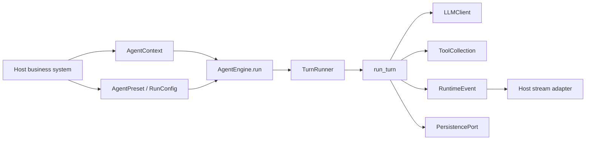

# AgentEngine Project Tour

AgentEngine 当前定位是可嵌入业务系统的 Agent 运行引擎。核心发布物是 `agentengine` 包；本仓库里的 Web、CLI 和默认 agents 都是 reference app / examples，用来演示业务系统如何集成引擎。

## 目录边界

```text
src/agentengine/
  engine.py          SDK facade: AgentEngine
  preset.py          AgentPreset declaration
  base/              AgentContext, AgentRun, AgentState
  runtime/           TurnRunner, run_turn(), RuntimeEvent
  llm/               LLMClient protocol and OpenAI-compatible client
  tools/             Tool, ToolCollection, ToolExecutor, builtin tools
  memory/            Message and Memory
  persistence/       PersistencePort and SQLite reference adapter
  concurrency/       InMemory and Redis conversation lock managers
  enterprise/        Optional middleware: quota, approval, tracing, retry
  stream/            SSE adapter primitives

examples/reference_app/
  agents/            Example AgentPreset registry
  services/          Reference service wrapper and FastAPI/SSE endpoint

examples/
  minimal_chat.py
  custom_tool_and_persistence.py

web/                 Local test frontend
scripts/             CLI demos
tests/               Pytest suite
docs/                API, integration, and module docs
```

`pyproject.toml` only packages `agentengine*`. `examples/reference_app`, `scripts`, and `web` are not core SDK surface.

## Main Flow



The host system owns authentication, authorization, tenant routing, HTTP endpoints, and configuration. The engine owns the run loop, tool execution, event emission, persistence calls, and conversation locking.

## Public SDK Entry

Use `agentengine.AgentEngine` for new integrations:

```python
from agentengine import AgentContext, AgentEngine, AgentPreset

engine = AgentEngine(
    presets={"chat": AgentPreset(name="chat", instructions="Answer briefly.")}
)

context = AgentContext(
    request_id="req-1",
    query="hello",
    llm=llm,
    conversation_id="conv-1",
)

result = await engine.run(agent_name="chat", query=context.query, context=context)
```

The core SDK does not read environment variables, does not import the reference app registry, and does not auto-register `SkillTool`.

## Reference App

`examples/reference_app/services/agent_orchestration_service.py` wraps `AgentEngine` for old demos. It keeps the old convenience behavior:

- uses the example preset registry
- can create an LLM from env vars
- defaults `require_llm=False`

The FastAPI app lives at `examples/reference_app/services/web_api.py`:

```bash
uv run --env-file .env uvicorn examples.reference_app.services.web_api:app --host 127.0.0.1 --port 8000
```

Treat this as a sample transport adapter, not an engine requirement.

## Extension Points

- `LLMClient`: swap model providers.
- `PersistencePort`: connect application storage.
- `ConversationLockManager`: use memory for single process, Redis/Postgres/Etcd for multi-replica deployments.
- `Tool`: inject domain tools.
- `AgentPreset` / `RunConfig`: declare agent behavior.
- `MiddlewareChain`: enable optional quota, approval, tracing, retry, or audit behavior.
- `RuntimeEvent`: build your own SSE, WebSocket, gRPC, or queue adapter.

## Important Docs

- [INTEGRATION.md](INTEGRATION.md): embedding guide for host systems.
- [docs/PUBLIC_API.md](docs/PUBLIC_API.md): public API and compatibility boundary.
- [docs/API.md](docs/API.md): API overview.
- [docs/STREAMING_PROTOCOL.md](docs/STREAMING_PROTOCOL.md): SSE reference adapter protocol.
- [docs/PRODUCTION_READINESS.md](docs/PRODUCTION_READINESS.md): production notes.
