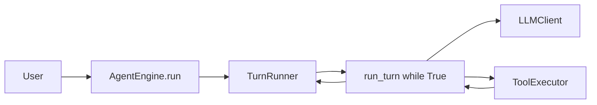

# AgentEngine

可嵌入业务系统的 Python Agent 运行引擎。负责 LLM 调用、ReAct 循环、工具调度、事件流和会话管理；认证、鉴权、租户路由、HTTP 端点由宿主系统负责。

**当前版本：v0.2.0** | **[PUBLIC_API.md](PUBLIC_API.md)**

---

## 架构



循环没有内置步数上限，结束条件：模型不返回 `tool_calls`、`AfterTurn` hook 终止、自动压缩失败、中断请求、或 API/运行时错误。

### 安全层

1. `AgentPreset` 追加默认"持续工作直到完成"指令
2. 自动压缩：通过可插拔 `Compactor` 摘要过长历史
3. 结构化错误：区分上下文窗口超限和用量限制
4. Hook：拦截会话开始、用户输入、工具调用、轮后检查、终止
5. `ExecPolicy`：工具白名单/黑名单/询问前缀规则
6. `AgentEngine.interrupt(request_id)`：取消活跃运行

---

## 安装

```bash
# uv（推荐）
uv sync --extra dev

# 或 pip
pip install -e ".[dev]"
```

配置 `.env`：

```bash
LLM_API_KEY=sk-your-api-key-here
LLM_MODEL=deepseek-chat
LLM_BASE_URL=https://api.deepseek.com/v1
```

验证：

```bash
uv run --env-file .env pytest -q
```

快速启动参考应用：

```bash
# Windows
.\quick_start.cmd

# macOS / Linux
chmod +x quick_start.sh
./quick_start.sh
```

---

### 创建 LLM 客户端

框架提供 `create_llm_from_env()`，从环境变量读取模型配置。生产环境中业务系统通常从配置中心或数据库加载：

```python
from agentengine.llm.openai_compat import OpenAICompatibleClient
from agentengine.llm.env import create_llm_from_env  # 环境变量便捷工厂

# 方式 A：从环境变量创建（开发/脚本）——读取 LLM_API_KEY / LLM_MODEL / LLM_BASE_URL
llm_client = create_llm_from_env()

# 方式 B：从配置中心或数据库创建（生产环境）
llm_client = OpenAICompatibleClient(
    base_url=config.get("llm_base_url"),   # 从配置中心读取
    api_key=secret_manager.get("api_key"), # 从密钥管理读取
    model=user.preferred_model,            # 按用户偏好选择模型
    timeout=120.0,
)
```

### 最小用法

```python
import asyncio
from agentengine import AgentContext, AgentEngine, AgentPreset

# ── 1. 定义 Agent ────────────────────────────────────────────
engine = AgentEngine(presets={
    "assistant": AgentPreset(
        name="assistant",                               # Agent 名称，run 时引用
        instructions="你是一个专业的助手，简洁地回答用户问题。",  # 系统提示词
        auto_compact_tokens=120_000,                    # 超过 12 万 token 自动压缩历史
    )
})

# ── 2. 创建流式上下文 ────────────────────────────────────────
# create_streaming_context 返回 (context, event_stream)
# event_stream 是异步队列，实时推送事件帧
context, event_stream = engine.create_streaming_context(
    request_id="req-001",
    query="帮我总结一下用户资料",
    conversation_id="conv-001",
)
context.llm = llm_client  # 注入 LLM 客户端（见上方创建方式）

# ── 3. 后台运行 Agent ────────────────────────────────────────
task = asyncio.create_task(
    engine.run(agent_name="assistant", query=context.query, context=context)
)

# ── 4. 消费事件流 ────────────────────────────────────────────
# 每个 frame 是 {"event": str, "data": dict}
async for frame in event_stream:
    event_type = frame["event"]
    data = frame["data"]

    if event_type == "text":
        print(data["delta"], end="", flush=True)          # 文本增量，实时打印
    elif event_type == "thinking":
        print(f"[思考] {data['delta']}", end="")           # 推理增量
    elif event_type == "tool_call_start":
        print(f"\n[工具调用] {data['tool']}({data['arguments']})")
    elif event_type == "tool_result":
        print(f"[工具结果] {data['result']}")
    elif event_type == "done":
        print(f"\n[完成] {data['result']}")                # 最终答案摘要
    elif event_type == "error":
        print(f"\n[错误] {data['code']}: {data['message']}")

# ── 5. 获取完整结果 ──────────────────────────────────────────
answer = await task  # 完整最终回答字符串
```

> 也可以把 Agent 写成 Markdown 文件（YAML frontmatter + 正文，格式同 Claude Code subagent），用 `load_presets("agents/")` 批量加载。frontmatter 的 `tools: [read_file, Skill]` 会自动装配内置工具，无需手写 `setup`。详见 [PUBLIC_API.md](PUBLIC_API.md) 的「用 Markdown 声明 Agent」。

全部公开 API 见 **[PUBLIC_API.md](PUBLIC_API.md)**（含完整类签名、事件契约、错误层次结构和集成说明）。

---

## 快速上手

### CLI 聊天

```bash
# Rich 卡片模式
PYTHONIOENCODING=utf-8 uv run python scripts/chat_pretty.py general_chat "你好"

# 深度研究（显示推理过程）
PYTHONIOENCODING=utf-8 uv run python scripts/chat_pretty.py deep_research "分析架构" --show-reasoning expanded
```

### 完整 SDK 示例

```bash
# 端到端 SDK 接入示例
uv run --env-file .env python examples/full_sdk_example.py
```

### Web 示例

```bash
# 启动后端
uv run --env-file .env uvicorn examples.services.web_api:app --host 127.0.0.1 --port 8000

# 启动前端
cd examples/web && npm install && npm run dev   # http://localhost:5173
```

---

## 流式输出 — 回调方式

上方的 `SseEventQueue` 模式适合 Web 服务（推送到 SSE/WebSocket）。如果只需要在本地消费事件，用 `on_event` 回调更简洁：

```python
from agentengine import AgentContext, RuntimeEvent

async def on_event(event: RuntimeEvent):
    event_dict = event.to_dict()           # 转成 dict，包含 type 和各字段
    print(f"[{event_dict['type']}] {event_dict}")

context = AgentContext(
    request_id="req-001", query="你好", llm=llm_client
)
answer = await engine.run(
    agent_name="assistant",
    query="你好",
    context=context,
    on_event=on_event,                     # 传入回调函数
)
# answer 是完整字符串，on_event 是旁路通知
```

---

## 前端接入

事件帧（`{"event": str, "data": dict}`）可以直接转为 SSE 或 WebSocket 推送给前端。

### FastAPI SSE

```python
from fastapi import FastAPI
from fastapi.responses import StreamingResponse
import asyncio, json, uuid

app = FastAPI()
engine = AgentEngine(presets={...})

@app.get("/api/runs/stream")
async def run_stream(q: str):
    request_id = str(uuid.uuid4())

    async def events():
        context, event_stream = engine.create_streaming_context(
            request_id=request_id,
            query=q,
            conversation_id="",   # 或从请求参数获取
        )
        context.llm = llm_client

        # 后台运行 Agent
        task = asyncio.create_task(
            engine.run(agent_name="assistant", query=q, context=context)
        )

        # 逐帧推送到 SSE
        async for frame in event_stream:
            yield f"event: {frame['event']}\ndata: {json.dumps(frame['data'], ensure_ascii=False)}\n\n"

        await task  # 确保 run 完成

    return StreamingResponse(
        events(),
        media_type="text/event-stream",
        headers={
            "Cache-Control": "no-cache",
            "X-Accel-Buffering": "no",      # 禁用 nginx 缓冲
        },
    )
```

### 通用异步 HTTP（aiohttp / Sanic / 自建）

```python
async def handle_request(ws, query: str):
    context, event_stream = engine.create_streaming_context(
        request_id=str(uuid.uuid4()),
        query=query,
    )
    context.llm = llm_client

    task = asyncio.create_task(
        engine.run(agent_name="assistant", query=query, context=context)
    )

    async for frame in event_stream:
        # → 推送到 WebSocket 或响应流
        await ws.send_json(frame)

    return await task
```

前端消费示例（JavaScript）：

```javascript
const eventSource = new EventSource(`/api/runs/stream?q=${encodeURIComponent("你好")}`);

eventSource.addEventListener("text", (e) => {
    const data = JSON.parse(e.data);
    console.log(data.delta);  // 实时打印文本增量
});
eventSource.addEventListener("tool_call_start", (e) => {
    const data = JSON.parse(e.data);
    console.log("工具调用:", data.tool);
});
eventSource.addEventListener("done", (e) => {
    const data = JSON.parse(e.data);
    console.log("完成:", data.result);
    eventSource.close();
});
eventSource.addEventListener("error", (e) => {
    const data = JSON.parse(e.data);
    console.error("错误:", data.code, data.message);
});
```

---

## 业务系统集成

### 注入 LLM

核心 SDK 只依赖 `LLMClient` 协议，不绑定任何提供商。两种注入方式：

```python
# 方式 A：通过 llm_factory 回调（推荐用于 Web 服务）
# 每次 run() 缺少 context.llm 时自动调用，适合按租户/用户动态创建 LLM
engine = AgentEngine(
    presets=presets,
    llm_factory=lambda: app_container.llm_client(),  # 回调返回 LLMClient 实例
)

# 方式 B：每个请求显式注入
# 适合每个请求有不同模型、API key 或 tracing 配置的场景
context = AgentContext(
    request_id=request_id,
    query=query,
    llm=app_container.llm_client_for_user(current_user),  # 直接传入 LLMClient 实例
)
```

### 注入持久化

实现 `PersistencePort` 接口后注入。`conversation_id` 非空时，引擎会在 run 前自动加载历史消息，结束后自动保存：

```python
engine = AgentEngine(
    presets=presets,
    persistence=PostgresPersistence(pool),  # 你的持久化实现（PG/MySQL/Mongo 等）
)
```

### 注入工具

工具通过 `AgentContext.tool_collection` 显式注入，不注入则不可用：

```python
context = AgentContext(
    request_id=request_id,
    query=query,
    llm=llm,
    tool_collection=ToolCollection([
        ProfileLookupTool(),  # 自定义工具实例
        ReadFileTool(),      # 内置工具也可以手动注入
    ]),
)
```

### 会话锁

单进程用默认 `InMemoryConversationLockManager`。多副本部署必须注入分布式锁，否则同一会话可能并发执行：

```python
from agentengine import RedisConversationLockManager

engine = AgentEngine(
    presets=presets,
    lock_manager=RedisConversationLockManager(redis_client),  # 传入 Redis 客户端
)
```

### Middleware

`agentengine.enterprise` 是可选中间件集合，按需启用。中间件按洋葱模型执行：

```python
from agentengine.enterprise import MiddlewareChain, QuotaStore, quota_middleware

middleware = MiddlewareChain([
    quota_middleware(QuotaStore()),    # 配额限制：限制每个租户的调用次数
    # approval_middleware(gate),       # 审批：破坏性工具执行前等待人工确认
    # otel_tracing_middleware(),       # 追踪：OpenTelemetry 分布式链路
    # retry_middleware(),              # 重试：LLM 调用失败自动重试
])

engine = AgentEngine(presets=presets, middleware=middleware)
```

---

## 注意事项

- 不要 `import examples` — 那是示范代码，不属于 SDK，需要就复制到你的代码库改造
- 不要依赖 `agentengine.runtime.turn` 等内部模块 — 只用 `agentengine` 包根的公开导入
- 不要在多副本生产环境用默认锁 — `InMemoryConversationLockManager` 只在单进程有效，必须换 Redis
- 不要把 query 不脱敏直接进引擎 — PII 处理是业务系统责任

---

## 常见问题

**Q: 没有 API Key 能运行吗？**
可以运行测试（使用 MockLLM），但不能调用真实模型。

**Q: 支持哪些模型？**
任何 OpenAI 兼容端点：DeepSeek、OpenAI、Azure OpenAI、智谱、本地 vLLM / Ollama 等。

**Q: engine.run() 是等全部回答完才返回吗？**
是的。返回类型始终是 `str`（完整最终回答）。流式输出通过旁路通道（`SseEventQueue` 或 `on_event`）实时推送。

**Q: llm_client 必须自己实现吗？**
不需要。框架自带 `OpenAICompatibleClient`，通过 `create_llm_from_env()` 从环境变量创建。自定义只需实现 `chat()` 和 `chat_stream()` 两个异步方法。

**Q: request_id 怎么生成？**
`str(uuid.uuid4())` 即可。Web 项目建议从中间件透传 `X-Request-ID` 头。

---

## 目录结构

```text
src/agentengine/        核心 SDK，唯一发布包
examples/               参考应用和示例脚本
examples/web/           React + Vite 前端参考应用
scripts/                CLI 聊天工具
tests/                  pytest 测试
```

## 测试

```bash
uv run --env-file .env pytest
```

---

## 文档

- [0.2 版本说明](docs/release-0.2.md)
- [AgentEngine 集成说明](docs/agent-integration.md)
- [公开 API](PUBLIC_API.md)
