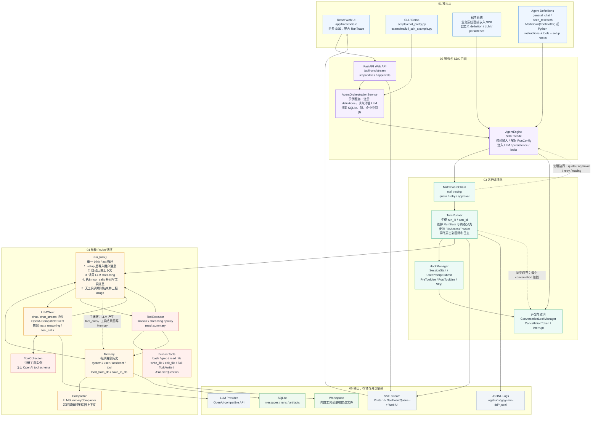

# AgentEngine 整体架构图

## 核心链路

1. Web、CLI 或宿主系统把用户请求交给 `AgentEngine`。
2. `AgentEngine` 解析 definition / `RunConfig`，注入 LLM、持久化、锁和中间件。Definition 可用 Python 构造，也可用 Markdown（YAML frontmatter + 正文）声明，经 `load_definition` / `load_definitions` 编译为 `AgentDefinition`（frontmatter 的 `tools` 列表会自动装配内置工具）。
3. `TurnRunner` 包住一次运行，负责运行 ID、状态、事件扇出、日志和 hook 生命周期。
4. `run_turn()` 执行单一 ReAct 循环：读写 `Memory`，调用 `LLMClient`，执行 `tool_calls`，再把工具结果写回 `Memory`。
5. 运行事件同时进入 SSE、JSONL 日志和外部回调；历史消息通过 SQLite 持久化。
