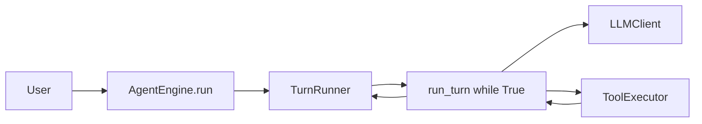

# Architecture

AgentEngine keeps orchestration in one runtime loop and pushes policy decisions
to explicit safety layers.

## Main Flow

The loop has no built-in step cap. It ends when the model returns no
`tool_calls`, an `AfterTurn` hook stops it, auto-compaction fails, an interrupt
is received, or a terminal API/runtime error is raised.

## Safety Layers

1. `AgentPreset` appends the default "keep going until resolved" instruction.
2. Auto-compaction can summarize long memory via a pluggable `Compactor`.
3. Structured errors classify context-window and usage-limit failures.
4. Hooks intercept session start, user prompt, tool use, after-turn checks, and
   terminal stop.
5. `ExecPolicy` gates tools with allow/deny/ask prefix rules.
6. `AgentEngine.interrupt(request_id)` cancels active runs.

## Runtime State

`RunConfig` is immutable configuration. `AgentRun` is per-run mutable state.
`AgentContext` carries dependencies and host-provided extras.
