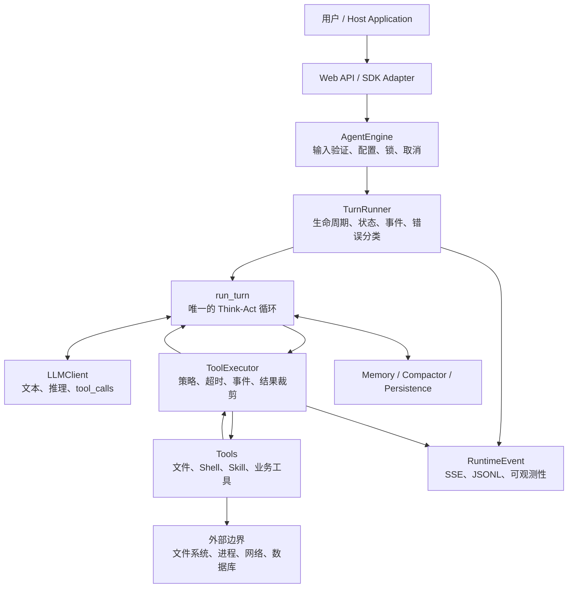
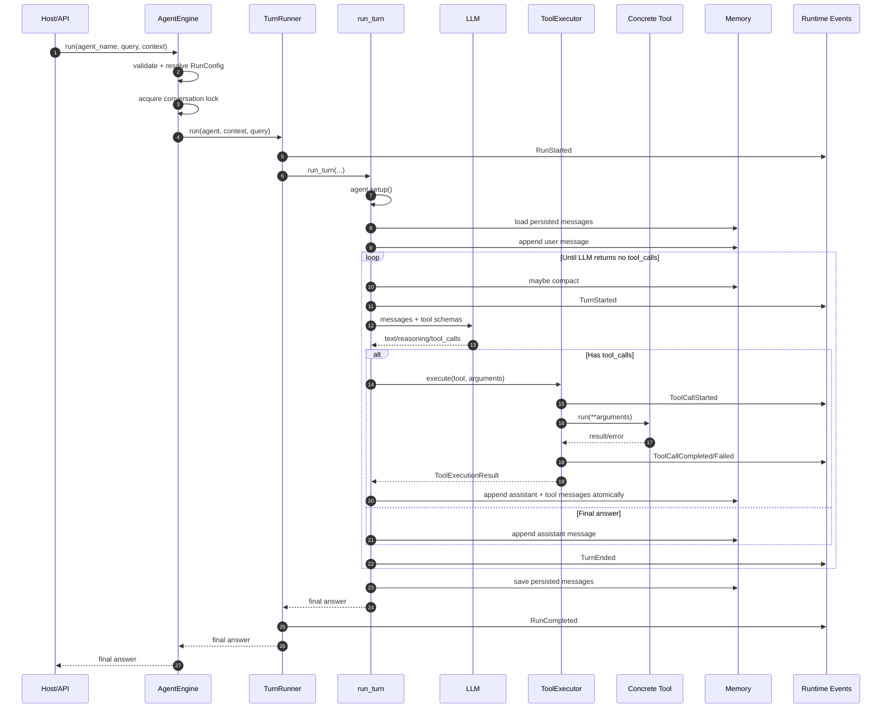
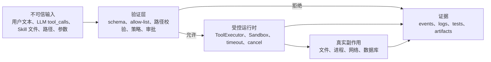
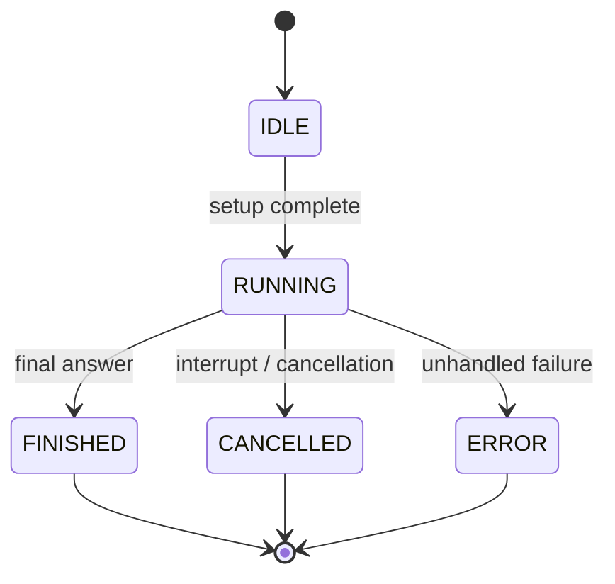
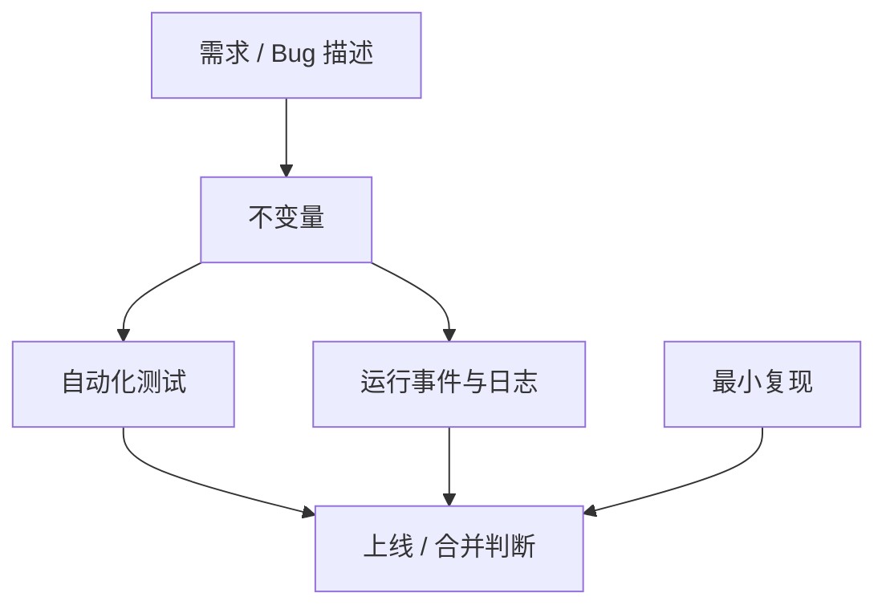
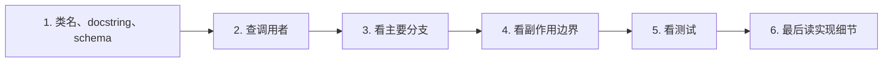
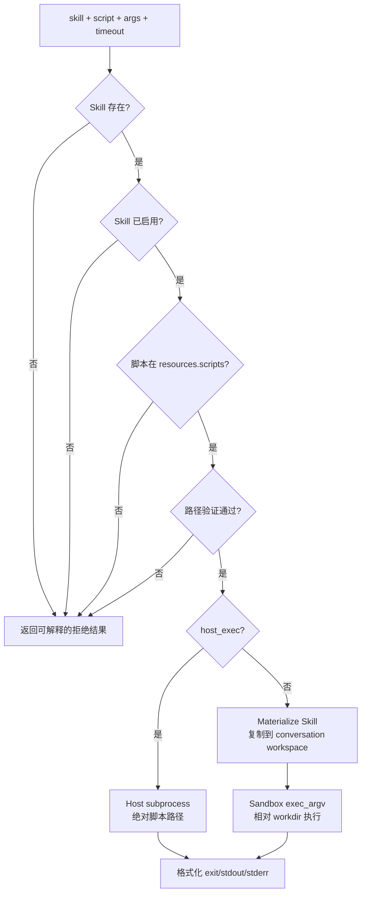
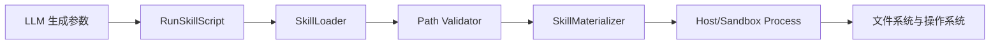
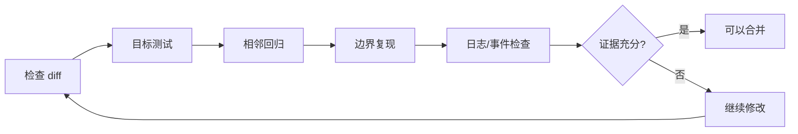

# AgentEngine 工程掌控指南

这份指南面向这样的阶段：

- 你能够使用 Python 完成功能；
- 你已经借助 AI 构建出一个规模不小的 Agent 系统；
- 代码继续增长后，你不再可能逐行记住全部实现；
- 你希望从“能生成代码”升级到“能对系统正确性负责”。

掌控一个系统，不等于记住每一行代码。真正的掌控是：

1. 能画出关键请求如何穿过系统；
2. 能说清每个模块负责什么、不负责什么；
3. 能在修改前指出风险和必须保持的不变量；
4. 能用测试、日志和运行事件证明修改正确；
5. 出现故障时能定位、止损和回滚。

---

## 1. 先建立正确的心智模型

不要把 AgentEngine 看成“一堆 Python 文件”。它更像一组相互协作的控制层。



你不需要同时深入理解所有节点。优先掌握三条主线：

1. **控制流**：请求下一步会去哪里；
2. **数据流**：消息、工具参数、工具结果如何变化；
3. **信任边界**：哪些输入是不可信的，哪里会产生真实副作用。

### 1.1 当前项目的核心文件

| 问题 | 首先阅读 | 需要掌握的内容 |
|---|---|---|
| 一次运行从哪里开始 | `src/agentengine/engine.py` | 输入验证、配置解析、锁、取消、Runner 创建 |
| 生命周期如何结束 | `src/agentengine/runtime/turn_runner.py` | run/turn ID、状态、事件、异常分类 |
| Agent 为什么持续调用工具 | `src/agentengine/runtime/turn.py` | LLM 循环、memory、tool_calls、停止条件 |
| 工具如何统一执行 | `src/agentengine/tools/executor.py` | policy、timeout、streaming、结果裁剪 |
| 工具从哪里找到 | `src/agentengine/tools/collection.py` | 工具注册与 schema 暴露 |
| Skill 如何发现 | `src/agentengine/skills/loader.py` | SKILL.md、资源清单、缓存 |
| Skill 如何进入沙箱 | `src/agentengine/skills/materializer.py` | 复制、缓存、路径与符号链接 |
| Skill 脚本如何执行 | `src/agentengine/tools/builtin/skill_script_tool.py` | allow-list、路径校验、host/sandbox 分支 |
| 对话如何保留 | `src/agentengine/memory/memory.py` | 消息结构、裁剪、原子消息组 |
| 运行如何被观察 | `src/agentengine/runtime/events.py` | 稳定事件协议 |

第一阶段只要能解释这些文件之间的关系，不需要记住内部所有函数。

---

## 2. 掌握一次真实请求

这是你应该能够不看代码讲出来的主流程。



### 2.1 你应该能回答的问题

不看具体实现，尝试回答：

- 谁创建 `run_id` 和 `turn_id`？
- 谁负责 conversation lock？
- 谁负责停止循环？
- 工具异常会不会直接导致整个 Agent 崩溃？
- 工具执行结果在哪里变成 LLM 的下一条消息？
- 取消信号在哪些位置被检查？
- memory 何时加载、何时保存？
- SSE 和 JSONL 是否来自同一套事件？

回答不出来时，只沿着调用链查对应问题，不要从文件第一行开始通读。

---

## 3. 用四张地图控制复杂度

每当模块增多时，不要继续扩大脑内记忆。维护下面四张地图。

### 3.1 模块责任地图

每个模块只记录四项：

| 模块 | 输入 | 输出 | 核心责任 | 明确不负责 |
|---|---|---|---|---|
| `AgentEngine` | agent 名、query、context | 最终文本 | 装配一次运行 | 不实现 ReAct 循环 |
| `TurnRunner` | AgentRun、context | 最终文本、运行事件 | 生命周期与状态 | 不解释工具业务 |
| `run_turn` | memory、LLM、tools | 最终文本 | Think-Act 循环 | 不直接处理 HTTP/SSE |
| `ToolExecutor` | Tool、arguments | `ToolExecutionResult` | 统一执行语义 | 不决定具体工具业务 |
| `RunSkillScript` | skill、script、args | 格式化进程结果 | 执行声明过的 Skill 脚本 | 不发现任意主机脚本 |

如果一个模块无法用一句话说清责任，通常说明它正在承担过多职责。

### 3.2 信任边界地图



重点不是“代码看起来合理”，而是所有从左向右的箭头是否都有明确控制。

### 3.3 状态地图



涉及生命周期的修改必须检查：

- 正常路径；
- 异常路径；
- 取消路径；
- teardown 失败；
- persistence 保存失败；
- 重复请求和并发请求。

### 3.4 证据地图



测试通过只是证据之一，不是最终结论。边界问题经常来自测试没有提出正确的问题。

---

## 4. 阅读代码时不要逐行平推

使用“七问阅读法”。打开任何模块，先回答：

1. **入口是什么？** 谁调用它？
2. **输出是什么？** 调用者依赖哪些字段或副作用？
3. **不变量是什么？** 哪些事情永远不能发生？
4. **分支是什么？** 正常、失败、取消、超时分别走哪里？
5. **边界是什么？** 文件、网络、进程、数据库在哪里发生？
6. **证据是什么？** 哪些测试和日志覆盖它？
7. **改动半径是什么？** 修改会影响谁？

推荐阅读顺序：



不要按“文件从上到下”阅读。按“问题从外到内”阅读。

### 4.1 三种理解深度

不是所有代码都值得同样投入。

| 层级 | 目标 | 适用代码 |
|---|---|---|
| L1 定位 | 知道职责、入口、文件位置 | UI、适配器、普通 DTO |
| L2 契约 | 知道输入、输出、失败语义 | 大部分业务模块 |
| L3 深入 | 能解释状态、并发、安全和边界 | 核心循环、工具执行、沙箱、持久化 |

建议按 `20/60/20` 分配：

- 20% 核心和高风险代码达到 L3；
- 60% 代码达到 L2；
- 20% 样板和低风险代码只达到 L1。

---

## 5. 当前文件案例：RunSkillScript

文件：`src/agentengine/tools/builtin/skill_script_tool.py`

不要先看每一行。先画它的决策过程。



### 5.1 它的输入契约

- `skill` 必须是已发现的 Skill 名；
- `script` 必须是相对于 Skill 根目录的 POSIX 路径；
- `script` 必须出现在 `resources.scripts` 中；
- `args` 是字符串数组，不经过 shell 解析；
- `timeout` 必须在 schema 指定范围内。

### 5.2 它的关键不变量

你应该把下面这些句子当作比实现更重要的资产：

1. 未声明的脚本永远不能执行；
2. 被禁用的 Skill 永远不能执行；
3. `../`、绝对路径和逃逸路径永远不能执行；
4. sandbox 分支只执行 materialized Skill 内的脚本；
5. host 分支只能执行通过同样验证的 Skill 脚本；
6. 参数必须作为 argv 传递，不能重新拼成 shell 命令；
7. 超时后进程必须结束并返回明确状态；
8. stdout/stderr 必须可观察，但不能无限增长。

以后 AI 修改这个文件时，先要求它证明这些不变量仍成立。

### 5.3 为什么这里风险高

这个工具跨越了多个信任边界：



任意一层出现错误，都可能变成：

- 任意文件读取；
- 任意脚本执行；
- 符号链接逃逸；
- 工作目录错误；
- 宿主机环境变量泄漏；
- 进程超时后残留；
- 输出过大拖垮上下文。

因此，进程、路径、权限相关代码必须达到 L3 理解深度。

### 5.4 当前测试覆盖了什么

`tests/test_skill_script_tool.py` 当前明确覆盖：

- 声明脚本正常执行；
- 参数保持 argv 数组；
- 未声明脚本被拒绝；
- 被禁用 Skill 被拒绝；
- 路径逃逸被拒绝；
- 未知 Skill 被拒绝。

你还应该持续关注这些边界用例：

- host 执行正常、超时和启动失败；
- `.sh` 与无扩展名脚本的解释器选择；
- `args` 中包含空格、引号和换行；
- materialized workdir 与脚本相对路径是否一致；
- Skill 目录中包含文件符号链接或目录符号链接；
- 脚本执行期间取消 Agent；
- stdout/stderr 极大或非 UTF-8；
- `timeout=0`、字符串 timeout、`NaN` 等绕过 schema 的直接调用。

这就是“测试设计能力”与“写测试数量”的区别。

---

## 6. 每次修改都执行一套固定协议

### 6.1 修改前

写下五句话：

```text
目标行为：
当前行为：
本次不修改：
必须保持的不变量：
最大风险：
```

如果这五项说不清，不要让 AI 直接大规模改代码。

### 6.2 修改中

要求 AI 按以下顺序工作：

1. 找入口和调用者；
2. 找现有测试和相邻实现；
3. 提出最小修改范围；
4. 先补能复现问题的测试；
5. 修改实现；
6. 运行目标测试；
7. 运行相邻回归测试；
8. 检查 diff 中是否混入无关改动。

### 6.3 修改后



完成标准不是“AI说改完了”，而是：

- 行为变化可描述；
- 不变量没有被破坏；
- 测试覆盖正常和失败路径；
- diff 范围合理；
- 运行时有足够证据定位问题。

---

## 7. 如何让 AI 成为工程杠杆

### 7.1 不要只问“帮我实现”

低质量请求：

```text
帮我给 Skill 增加脚本执行。
```

更好的请求：

```text
先分析 Skill 脚本从 LLM tool_call 到进程执行的完整调用链。
列出涉及的信任边界、必须保持的不变量和现有测试缺口。
然后做最小实现，优先复用现有 loader、path validator、
materializer 和 ToolExecutor。先增加失败用例，再修改代码。
完成后运行目标测试和相邻回归，并说明仍未覆盖的风险。
不要修改无关文件。
```

差距不在于提示词更长，而在于你是否定义了工程约束和验收证据。

### 7.2 让 AI 扮演不同角色

不要让同一次生成既当作者又当唯一审查者。至少分成三步：

1. **实现者**：完成最小改动；
2. **攻击者**：寻找路径、并发、取消、超时、数据泄漏问题；
3. **验证者**：检查测试是否真的能在旧实现上失败。

可直接使用：

```text
现在不要继续写功能。请以代码审查者身份检查刚才的 diff。
优先寻找：
1. 正常测试通过但边界条件失败的情况；
2. 输入验证与真实副作用之间的绕过路径；
3. 取消、超时、异常处理不一致；
4. 测试只验证 mock 调用、没有验证真实行为；
5. API 或日志泄漏内部数据。
先列缺陷，按严重程度排序，再给修复建议。
```

### 7.3 对 AI 输出保持三类怀疑

- **存在性怀疑**：它提到的类、配置、API 真的存在吗？
- **连接性怀疑**：新代码真的接入主调用链了吗？
- **行为性怀疑**：测试验证的是结果，还是只验证函数被调用？

---

## 8. 你的学习路线不应以语法为中心

### 第一阶段：掌握系统主干，1 到 2 周

目标：

- 能画出本指南中的请求链路；
- 能解释 `AgentEngine -> TurnRunner -> run_turn -> ToolExecutor`；
- 能跟踪一个 tool_call 直到结果进入 memory；
- 能找到运行事件和错误分类位置。

练习：

1. 手动画一次请求时序图；
2. 给每个核心模块写一句责任描述；
3. 选择一个测试，用断点跟完整调用链；
4. 故意传入未知工具，观察事件和 memory。

### 第二阶段：掌握失败路径，2 到 4 周

重点知识：

- Python async、task、timeout、cancel；
- subprocess 与 argv；
- 路径规范化、符号链接、工作目录；
- 异常传播与资源清理；
- 并发锁和共享状态。

练习：

1. 制造工具超时；
2. 在执行中调用 `interrupt`；
3. 制造 persistence 保存失败；
4. 制造脚本不存在、权限不足和非 UTF-8 输出；
5. 检查每种失败对应哪些 RuntimeEvent。

### 第三阶段：掌握演进能力，持续进行

目标：

- 新功能进入哪个模块由你决定；
- 能阻止跨层职责混乱；
- 能设计兼容的事件和 API；
- 能判断是否值得增加抽象；
- 能删除 AI 生成的无效复杂度。

重点产物：

- 架构图；
- 模块责任表；
- 不变量清单；
- ADR（架构决策记录）；
- 回归测试；
- 故障复盘。

---

## 9. 四周可执行计划

### 第 1 周：只掌握主链路

| 天 | 任务 | 产出 |
|---|---|---|
| Day 1 | 阅读 `engine.py` 和 `turn_runner.py` | 一张入口到 Runner 的图 |
| Day 2 | 阅读 `turn.py` 的主循环 | 一张 Think-Act 时序图 |
| Day 3 | 阅读 `executor.py` | 工具正常/失败/超时表 |
| Day 4 | 跟踪一个现有测试 | 调用链笔记 |
| Day 5 | 不看代码复述完整流程 | 找出仍然模糊的三个问题 |

### 第 2 周：掌握当前 Skill 子系统

| 天 | 任务 | 产出 |
|---|---|---|
| Day 1 | `loader.py` | Skill 输入契约 |
| Day 2 | `paths.py` | 路径安全不变量 |
| Day 3 | `materializer.py` | 复制与缓存流程图 |
| Day 4 | `skill_script_tool.py` | host/sandbox 决策图 |
| Day 5 | 设计 5 个恶意输入 | 新测试候选列表 |

### 第 3 周：掌握运行时证据

| 天 | 任务 | 产出 |
|---|---|---|
| Day 1 | 阅读 RuntimeEvent | 事件词典 |
| Day 2 | 跑一次完整请求 | run_id 对应的 JSONL |
| Day 3 | 制造一次工具失败 | 失败事件链 |
| Day 4 | 制造一次取消 | 取消事件链 |
| Day 5 | 总结“如何定位一次故障” | 故障排查 SOP |

### 第 4 周：独立控制一次变更

选择一个很小的真实改动，完整执行：

1. 写目标行为；
2. 画影响范围；
3. 写不变量；
4. 写失败测试；
5. 让 AI 实现；
6. 自己审 diff；
7. 运行回归；
8. 写五行复盘。

这一周最重要的不是功能价值，而是完整走一遍工程闭环。

---

## 10. 每周只维护五个问题

每周花 30 分钟更新：

1. 本周系统主链路发生变化了吗？
2. 新增了什么外部副作用？
3. 新增了什么不可信输入？
4. 哪个不变量现在缺少测试？
5. 出故障时，我能通过什么事件或日志看到它？

当这五个问题始终有答案时，代码增长不会等比例增加你的失控感。

---

## 11. 判断自己是否真的进步

不要用“读了多少文件”衡量。使用下面的能力阶梯。

### Level 1：能定位

- 能快速找到入口、调用者和测试；
- 不依赖 AI 猜文件位置。

### Level 2：能解释

- 能画出控制流和数据流；
- 能解释正常、异常、取消路径。

### Level 3：能验证

- 能写出会让旧实现失败的测试；
- 能区分 mock 通过和真实行为正确；
- 能从日志与事件定位故障。

### Level 4：能设计

- 能定义模块责任和稳定契约；
- 能预测修改半径；
- 能控制兼容性和复杂度。

### Level 5：能负责

- 能决定是否上线；
- 能说明已知风险；
- 能准备回滚和止损；
- 系统出问题时知道先看哪里。

AI 可以显著加速 Level 1 和代码产出，但 Level 3 到 Level 5 才是工程师真正拉开差距的位置。

---

## 12. 最终工作原则

把下面八条放在每次改动前：

```text
1. 我不需要记住所有代码，但必须知道核心调用链。
2. 我不相信“看起来正确”，我要明确不变量。
3. 我不把“测试通过”等同于“边界安全”。
4. 我优先检查文件、进程、网络、数据库等副作用边界。
5. 我要求 AI 给出证据，而不是只给出实现。
6. 我控制改动范围，不让一次需求顺便重构整个系统。
7. 我保留可观察性，让失败能够被定位。
8. AI 负责扩大产能，我负责定义正确性并承担判断。
```

当你能持续做到这些，你就不再是“只懂 Python、依赖 AI 写代码的人”，而是一个能够借助 AI 设计、验证和维护复杂系统的工程师。
